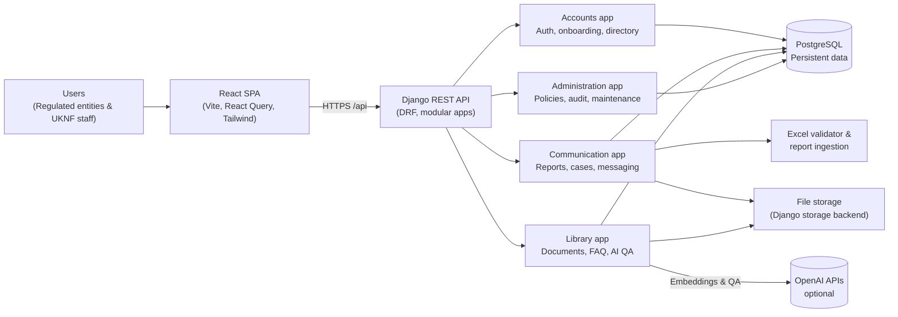

# UKNF Communication Platform (Django + React)

## Quick Links
- [OpenAPI specification](openapi.yaml)
- [Prompt analysis report](RAPORT_ANALIZA_LOGOW_CODEX.md)
- [Prompt details dossier](prompts.md)

Demonstration implementation of the UKNF communication and reporting platform. The stack aligns with the architectural guidelines: a Django REST backend providing the secure API surface and a React 18 frontend (Vite) delivering the operator UI. The solution covers the communication, authentication and administration modules described in `REQUIREMENTS.md`.

See interesting charts as well in `charts/` folder


## Feature Highlights

- Authentication & onboarding for external entities with activation flows, multi-entity session context switching, directory search and targeted user groups.
- Access request orchestration including per-entity lines, granular permission decisions, threaded discussions, attachments and an auditable history trail.
- Secure messaging workspace with entity-scoped threads, internal-only notes, broadcast campaigns (by user group or individual recipients) and file attachments.
- Reporting lifecycle that ingests Excel workbooks, auto-creates missing entity records, validates domain rules, records timelines and archives accepted filings in the regulatory library.
- Supervisory case handling with status timelines, assignee tracking, due dates plus regulatory announcements featuring acknowledgement rates and expiry windows.
- Regulatory knowledge base with curated documents, full-text search, FAQ feeds and an optional AI assistant that answers questions using OpenAI models and embedded document snippets.
- Administration surface exposing password policy management, data retention rules, maintenance calendars, comprehensive audit logs and configurable notification preferences.


## Test Admin login 

```bash 
admin@example.com
Admin1234!
```


## Repository Structure

- `backend/` – Django 5 project with Django REST Framework. Implements custom user model, regulated entity directory, report workflow, secure messaging, announcements, audit logging, password policies, library API and GDPR-oriented utilities.
- `frontend/` – React 18 single-page application built with Vite, TypeScript and Tailwind CSS. Consumes the backend API, offers dashboards for reports, messaging, announcements, document library and self-service settings. Uses `knf_logo.png` in the global layout.
- `docker-compose.yml` – Production-leaning stack (backend, frontend, Postgres).
- `dev-docker-compose.yml` – Hot-reload oriented setup for local development.
- `REQUIREMENTS.md` – Source specifications.
- `DETAILS_UKNF_#Prompt2Code2.pdf` – Original supporting material.

## System Architecture



## Getting Started

### Prerequisites

- Python 3.11+
- Node.js 20+
- Docker (optional, for containerised workflow)

### Backend (Django)

```bash
cd backend
python -m venv .venv
source .venv/bin/activate
pip install -r requirements.txt
cp .env.example .env
python manage.py migrate
python manage.py loaddata fixtures/seed_data.json  # optional demo data
python manage.py runserver
```

API base URL (dev server): `http://localhost:8000/api`

API base URL (docker compose): `http://localhost:8123/api`

**Platform**
- `GET /health` – service heartbeat check.
- `GET /schema` & `GET /docs` – OpenAPI schema and Swagger UI backed by drf-spectacular.

**Authentication & Directory**
- `POST /auth/register` / `POST /auth/activate` – external onboarding and activation.
- `POST /auth/login` / `POST /auth/logout` – obtain or revoke a DRF token (`Authorization: Token <key>`).
- `GET /auth/profile` – authenticated user details, memberships and active session context.
- `POST /auth/session` – change the acting entity for multi-entity users.
- `GET/PUT /auth/preferences` – notification channel configuration.
- `GET /auth/roles` – role catalogue metadata used by the UI.
- `GET/POST /auth/entities` – regulated entity directory (mutations restricted to internal staff; `POST /auth/entities/{id}/verify` logs verifications).
- `GET/POST /auth/memberships` – entity membership management (entity admins can add/remove their members).
- `GET /auth/access-requests` – onboarding workflow, including `GET /auth/access-requests/my-active`, `POST /auth/access-requests/{id}/submit`, `POST /auth/access-requests/{id}/return`, `POST /auth/access-requests/{id}/lines/{line_id}/approve` and `POST /auth/access-requests/{id}/lines/{line_id}/block`.
- `GET/POST /auth/access-requests/{id}/messages` and `POST /auth/access-requests/{id}/attachments` – threaded discussions and supporting documents for access requests.
- `POST /auth/contacts` – public contact form; `GET /auth/contacts` exposes submissions to internal reviewers.
- `GET /auth/users` – internal user directory search (read-only).
- `GET/POST /auth/user-groups` – internal user groups for broadcast targeting (system admins only).

**Communication**
- `GET/POST /communication/reports` – report submissions and review with upload endpoints (`POST /communication/reports/upload_new`, `POST /communication/reports/{id}/upload`, `POST /communication/reports/{id}/submit`) and status transitions (`POST /communication/reports/{id}/status`).
- `GET/POST /communication/cases` – supervisory case management with timeline tracking (create/update/delete limited to UKNF staff).
- `GET/POST /communication/messages` – secure threads with filters (`group`, `target_type`, `updated_after/before`), per-thread conversations via `GET/POST /communication/messages/{id}/messages` and broadcast campaigns (`POST /communication/messages/broadcast`).
- `GET/POST /communication/announcements` – regulatory announcements with `POST /communication/announcements/{id}/acknowledge` for receipt tracking.
- `GET /communication/library` – published regulatory resources.
- `GET /communication/faq` – active FAQ entries.

**Library**
- `GET /library/overview` – featured documents and FAQ highlights for the dashboard.
- `GET /library/search?q=` – full-text search over library documents.
- `POST /library/documents` / `DELETE /library/documents/{id}` – authenticated upload and removal of library artefacts.
- `POST /library/qa` – question-answering endpoint returning generated answers plus cited sources.

Set `OPENAI_API_KEY` (and optionally `OPENAI_MODEL` / `OPENAI_EMBEDDING_MODEL`) to enable semantic search embeddings and the AI assistant used by `/library/qa`. Without these variables the endpoint gracefully returns `503`.

**Administration (internal)**
- `GET/PUT /admin/password-policy` – password policy configuration (system scope).
- `GET /admin/audit-logs` – searchable audit trail (internal-only).
- `GET/POST /admin/retention` – CRUD for data-retention policies keyed by `data_type`.
- `GET/POST /admin/maintenance` – maintenance window scheduling with audit logging.

### Frontend (React)

```bash
cd frontend
npm install
npm run dev
```

Set `VITE_API_BASE_URL` to point at the backend (defaults to `http://localhost:8000/api`).

### Docker Workflow

Development containers with live reload:

```bash
docker compose -f docker-compose.yml up --build
```

Production-style build (Gunicorn + Vite build):

```bash
docker compose up --build
```

### Tests

```bash
cd backend
python manage.py test
```

(An initial auth integration test lives in `accounts/tests/test_auth.py`).

## Security & Compliance Features

- Token-based authentication, session context per acting entity
- Entity-scoped permissions with internal/external separation
- Comprehensive audit logging (`AuditLogEntry.record`) for sensitive actions
- Configurable password policy and notification preferences
- Report lifecycle states that mirror UKNF validation flow (draft → submitted → validated, etc.) paired with Excel workbook validation and automatic archiving of accepted filings.
- Secure messaging with internal notes, recipient targeting and announcements backed by acknowledgement tracking.
- Library & FAQ modules exposing regulatory artefacts with per-user access filters plus optional embeddings-backed AI answers.
- CORS, security headers and GDPR-friendly data retention models

## Accessibility & UX Highlights

**- WCAG-friendly palette and focus states**
- Responsive dashboard layout with quick access cards
- Status badges reflecting report validation states
- Forms with validation feedback (React Hook Form + Zod)
- Toast notifications for report actions (`sonner`)

## Next Steps

- Extend automated test coverage (API & frontend component tests)
- Integrate background workers for report validation pipelines
- Wire up SSO/identity provider for production environments
- Harden audit log persistence (append-only store) and add export tooling
